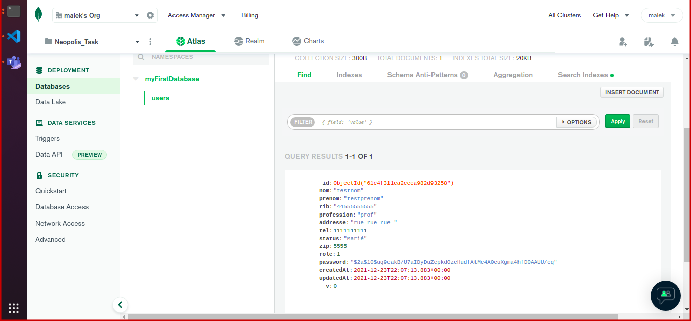
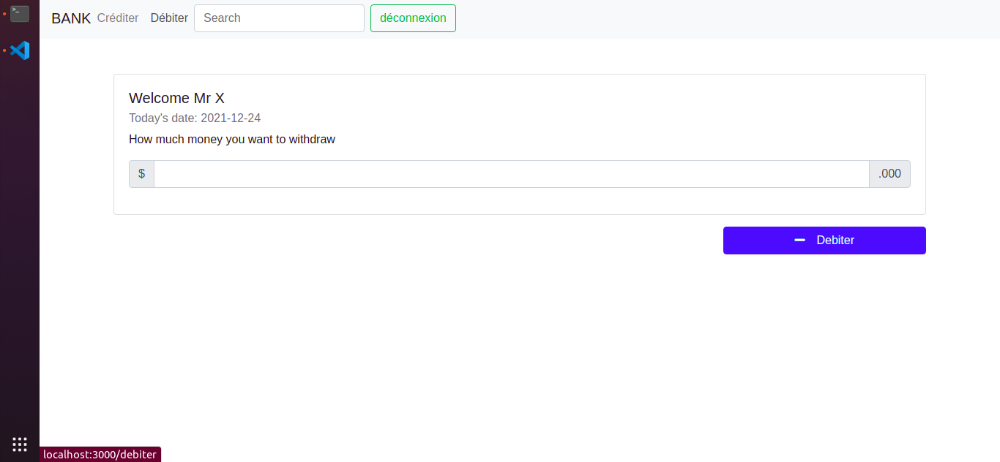

# Neopolis Task

This project was bootstrapped with [Create React App](https://github.com/facebook/create-react-app).

## Technologies utilisés :

### Frontend:

- ReactJS
- Bootstrap 4

### Backend:

- MongoDB
- Node js
- Express

### La partie Admin:

L'admin peut se connecter avec son propre compte, puis ili peut creer des comptes pour les utilisateur:

Il peut afficher les comptes existantes:

Il peut aussi consulter les transactions:

### Partie base des données MongoDB

Les informations de la créations des comptes vont étre enregister dans la base de données **MongoDB**

### La partie Client:

Le client peut se connecter avec son RIB et son mot de passe \_(que l'admin lui a attribuer ).

Le client peut crediter:

Le client peut debiter:

### Coté serveur:

Tous les étapes vont étre afficher:

